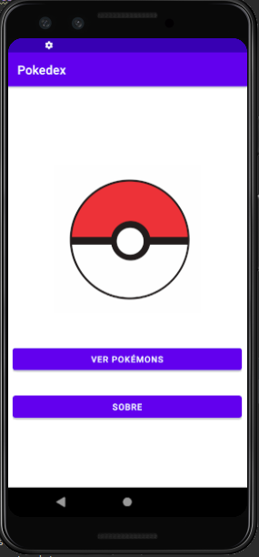

  

## 💻 Projeto

Projeto proposto para exibir os 150 primeiros pokémons disponiveis na api (https://pokeapi.co/api/v2/pokemon), exibindo id, nome do pokémon, tipos, imagem e utilizando RecycleViewr para realizar a exibição da lista de pokemons

  

  

### Conceitos abordados

- Linguagem Kotlin

- Consumo de api utlizando retrofit

- Utilização de recycleViwer para exibir os pokemons

## 📝 Integrantes

- Carlos Mendes

- Felipe Bircher

- Guilherme Moraes
